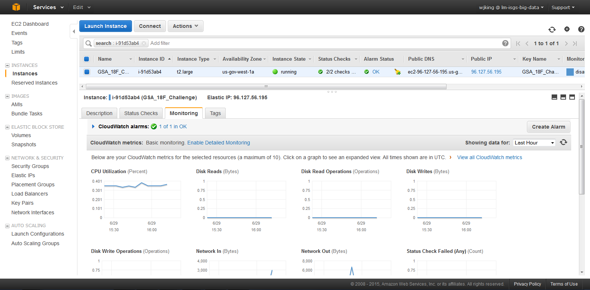
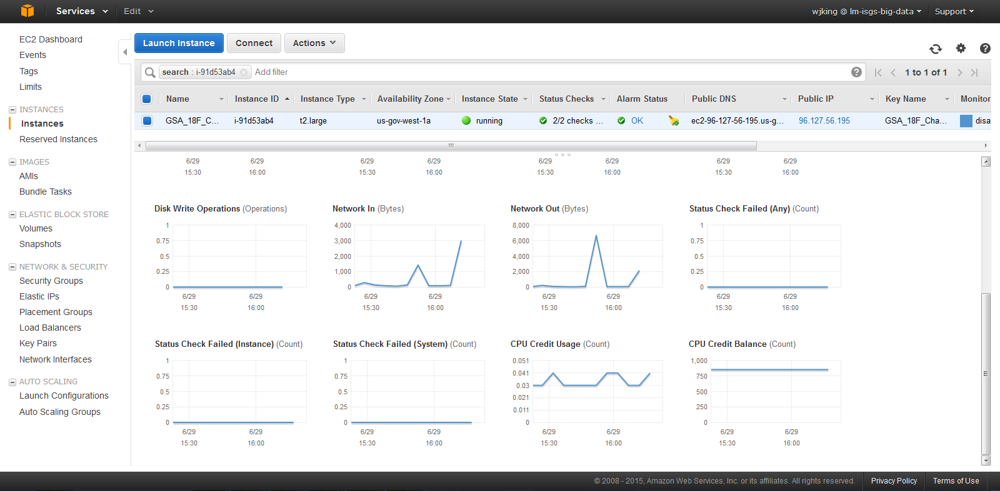
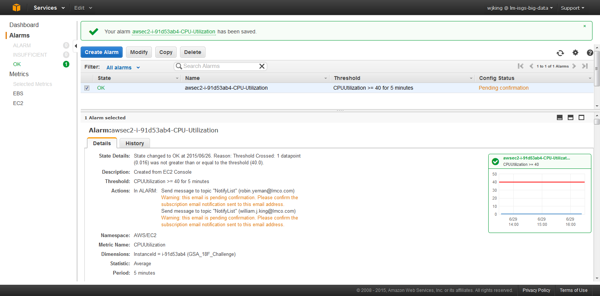

# Agile Delivery Services (ADS 1) FedMedCo

Provides a responsive human centered design interface that enables both novice and experienced users to search the openFDA data to identify critical drug information and display results across multiple devices.

## Features

* Reported Drug Reactions
* Drug to Food Interaction
* Interesting facts about drugs
* Open Query for search engine
* Multi-Device compatibility

## Web Technologies

|   | **Technology** | **Description** | **License** | **Version** | **Date** |
| --- | --- | --- | --- | --- | --- |
| 1. | Grails/Groovy | Web Framework/ language | Apache 2 | 2.4 | 2014 |
| 2. | HTML5/CSS3 using Bootstrap | Presentation / Responsive design supporting multi-device | MIT | 3.3.4 | 2015 |
| 3. | Sitemesh | HTML template framework based on Decoration Model | OpenSymphony(Apache) | 2.1.5 |   |
| 4. | GORM | Object relationship mapping | Apache 2 | 2.5.0 |   |
| 5. | MongoDB | NoSQL database JSON-like documents | GNU GPL | 3.0.4 | 2015 |
| 6. | JQuery | JavaScript library | MIT | 1.11.1 | 2014 |
| 7. | Selenium | Web Testing | Apache 2 | 2.46 | 2015 |
| 8. | Spock | Integration Test | Apache 2 | 0.7 | 2012 |

## Approach

Lockheed Martin has provided a Minimum Viable Product (MVP) directed at three main categories of users: patients, pharmaceutical manufacturers, and regulatory agencies. The drug reaction and food to drug interaction features are primarily for patients seeking information about medications they are using. The interesting facts about drugs feature and the open query are for both pharmaceutical manufacturers and regulatory agencies who have pharmaceutical domain knowledge and are performing a deep dive.

## Design Documents
[Design Documents](docs/)
* Architecture Diagrams
* Use Cases
* Personas
* Screen Mockups

## Installation

1. Start MongoDB
2. Deploy WAR to Tomcat
  1. Make sure Tomcat's default file limit is modified because it will not deploy otherwise, e.g. (�/webapps/manager/WEB-INF/web.xml)
  ```xml
    <multipart-config>
      <!-- 50MB max -->
      <max-file-size>92428800</max-file-size>
      <max-request-size>92428800</max-request-size>
      <file-size-threshold>0</file-size-threshold>
    </multipart-config>
  ```
  2. The WAR is built automatically by Jenkins and archived as part of the build for easy access.
3. Start application on Tomcat
4. Verify application running and can access each of the three queries
  1. I'm planning to get Z to automate this and execute it as part of the deployment monitoring process.

## Deployment

## Monitoring





## API Reference

[https://open.fda.gov/api/reference/](https://open.fda.gov/api/reference/)

## Test

JUnit unit testing.

## Contributors

Lockheed Martin

## License

All license agreements are Free and Open Source
[http://www.apache.org/licenses/License-2.0](http://www.apache.org/licenses/License-2.0)
[http://opensource.org/licenses/MIT](http://opensource.org/licenses/MIT)
[http://www.gnu.org/licenses/gpl-3.0.en.html](http://www.gnu.org/licenses/gpl-3.0.en.html)
[https://svn.apache.org/repos/asf/tiles/framework/trunk/OGNL-LICENSE.txt](https://svn.apache.org/repos/asf/tiles/framework/trunk/OGNL-LICENSE.txt)
