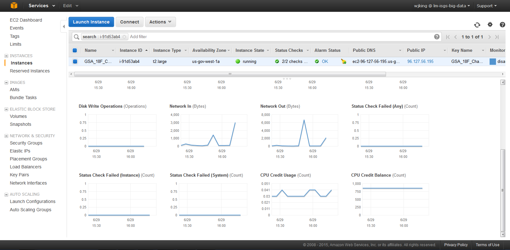

# Supporting Documentation

This directory contains supplementary resources used in the documentation of the application.

## Architecture Diagrams

## Personas & Use Cases

View the PDF containing our [Personas and User Scenarios](Personas_and_user_scenerios_for_18F.pdf).

## Screen Mockups

## Continuous Integration

We use Jenkins for our continuous integration server. The following screenshot shows the overall build status / Job Page:
* Shows linkages to GitHub, Sonar for Java and Grails, among the other default items.
* Shows the artifact created as part of the build when everything passes:  In this case, the WAR file for used for deployment and End to End automated testing.
* It also shows the typical issues like, I ran the server out of disk space, so, a number of builds failed until I could fix that this morning.  Which we document beside each build in the build history.  

An example of our test results in Jenkins:

## Continuous Inspection of Code Quality

We use the open source quality management platform SonarQube to analyze and measure code quality. The following image shows our SonarQube results for Groovy:
* You can see that we get an A rating on the SQALE for Technical debt despite having some issues that need to be fixed.  
* You can also see that we have our own Technical Debt calculator for LM that shows an Algorithm built by our LM Fellows based upon their experiences as they felt additional data was necessary to properly measure the debt.
* For instance, one of the important things that is being shown (second picture below which is part of this page, demonstrates how we have not fulfilled what our LM Fellows define as sufficient code commenting, and, as a result, we have incurred debt.
* You can also see our modified Success Criteria, we updated a number of the quality gates built into the default groovy configuration based upon our preferences.

## Monitoring

