# Screen Mockups

There are five query types that can be run, selected by clicking on the desired query type. Below is a description of each with screen shots. 

## Find out all names for your medication.

Input: A medicine name.
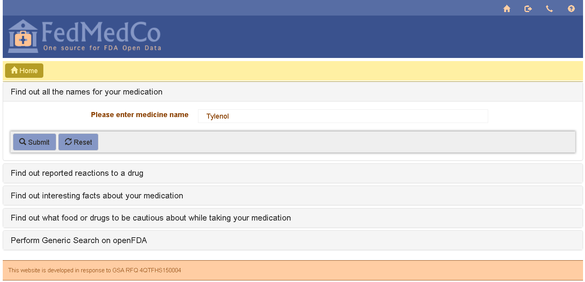

Output: other names for that medication. 
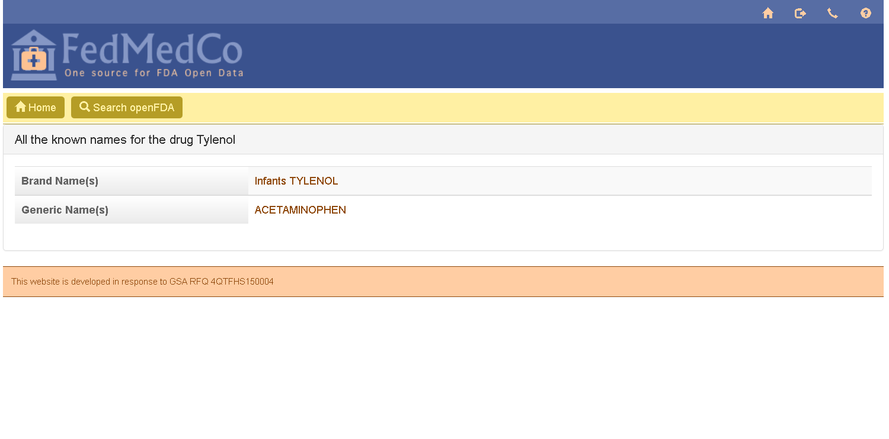

##Find out reported reactions to a drug.

Input: A medicine name.
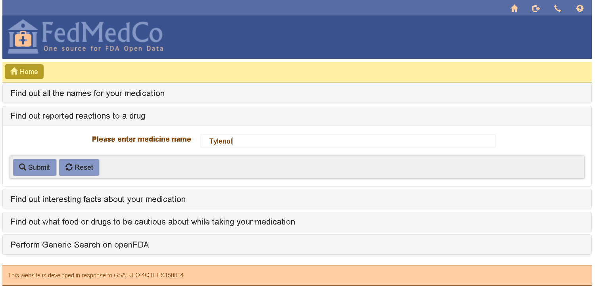

Output: The top three reactions to the drug, as well as all reactions broken down by severity. 
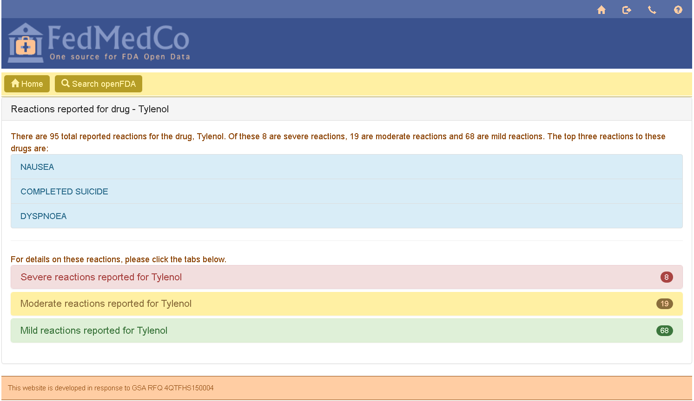

Click on each severity to expand that section. 
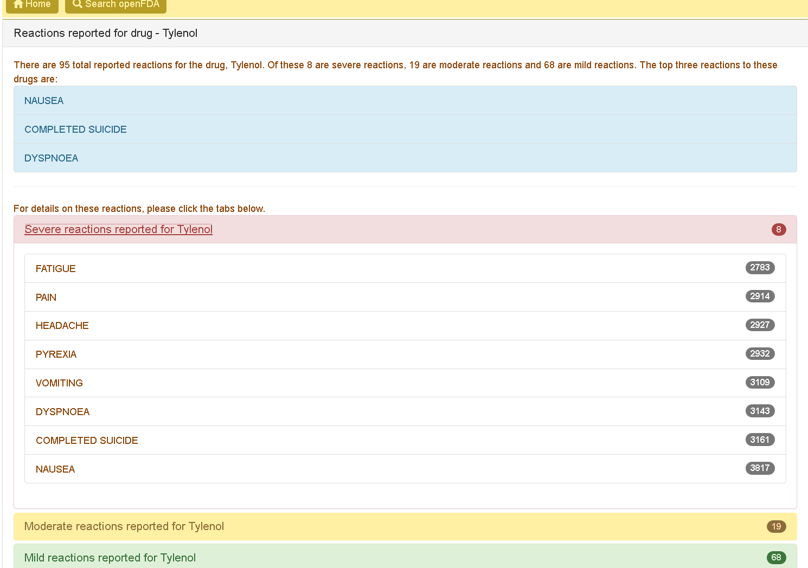

##Find out interesting facts about your medication. 

Input: A medicine name.
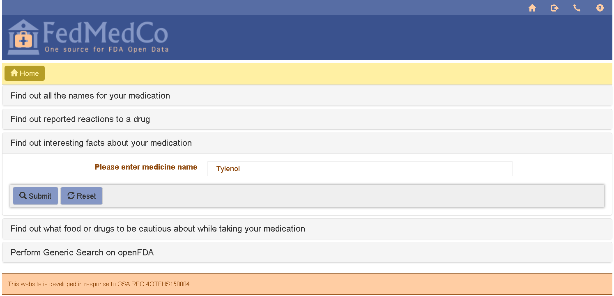

Output: Interesting facts about the medication.
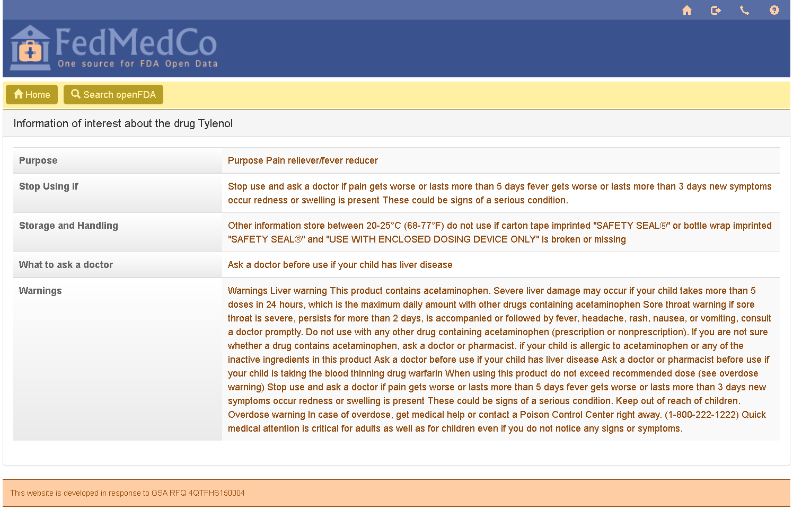

##Find out what food or drugs to be cautious about while taking your medication

Input: A medicine name, and another medicine name or food.   
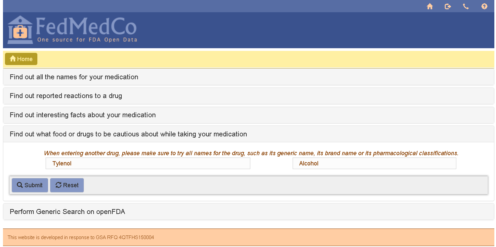

Output: Possible interactions (if any) between the given inputs.
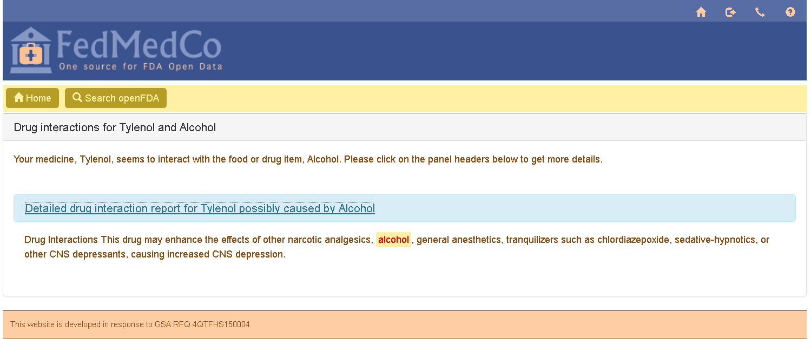

##Perform generic search on openFDA

Input: Select the Category, Subcategory, and fields from the drop downs. Enter the values you wish to search for in the query. A compound query can be created by clicking the "Add Another Field" button to the right. 
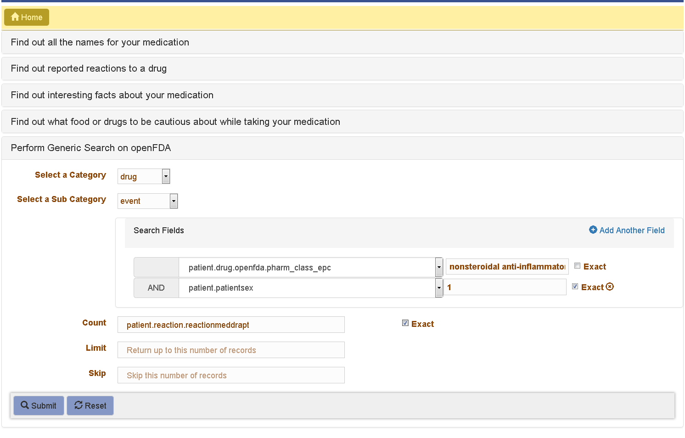

Output: The data returned from the query. 
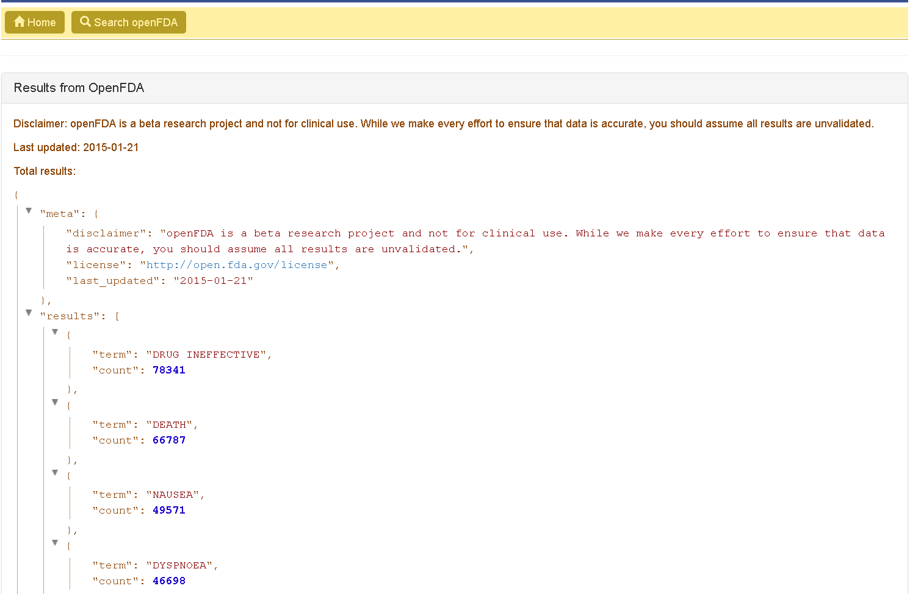
