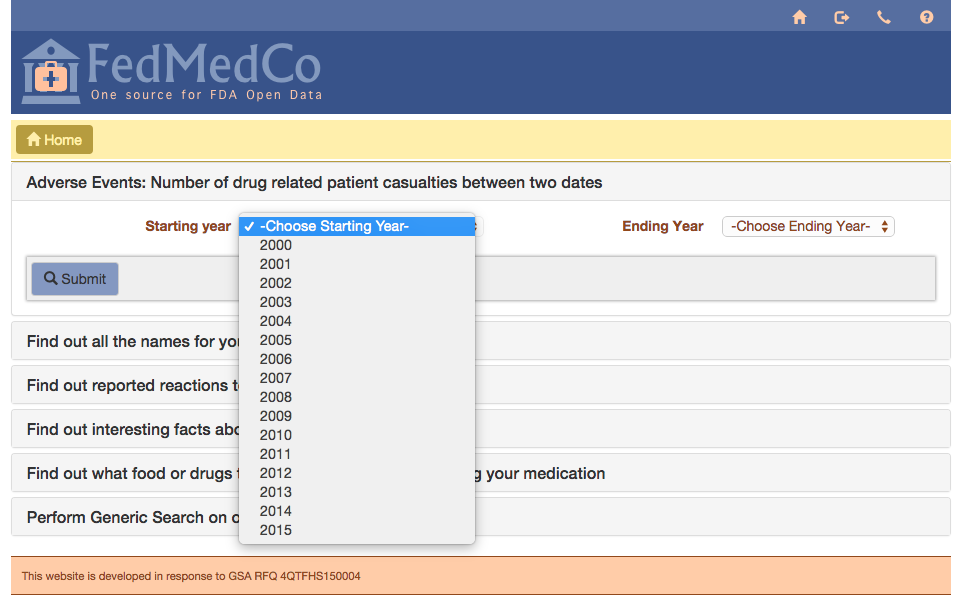
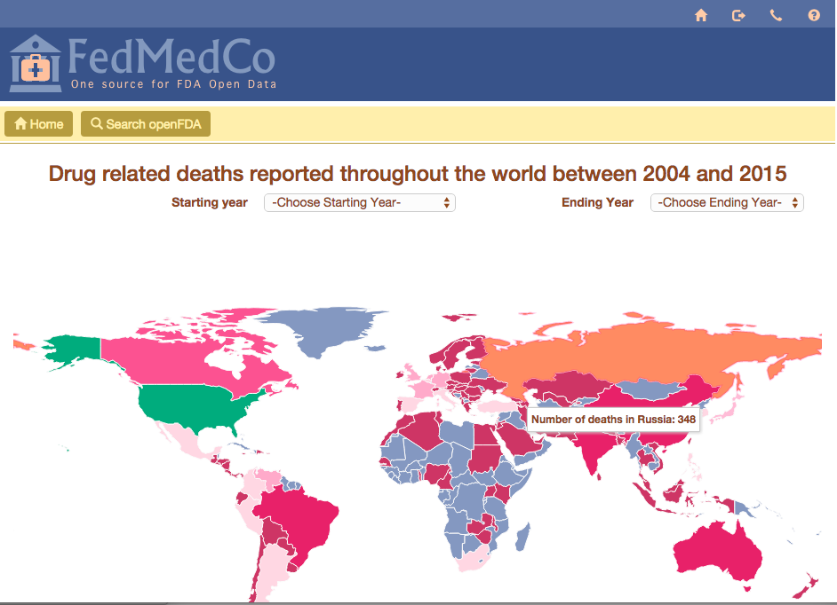
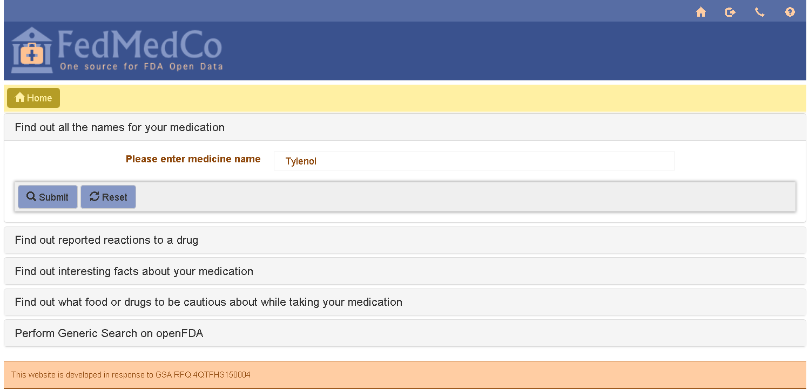
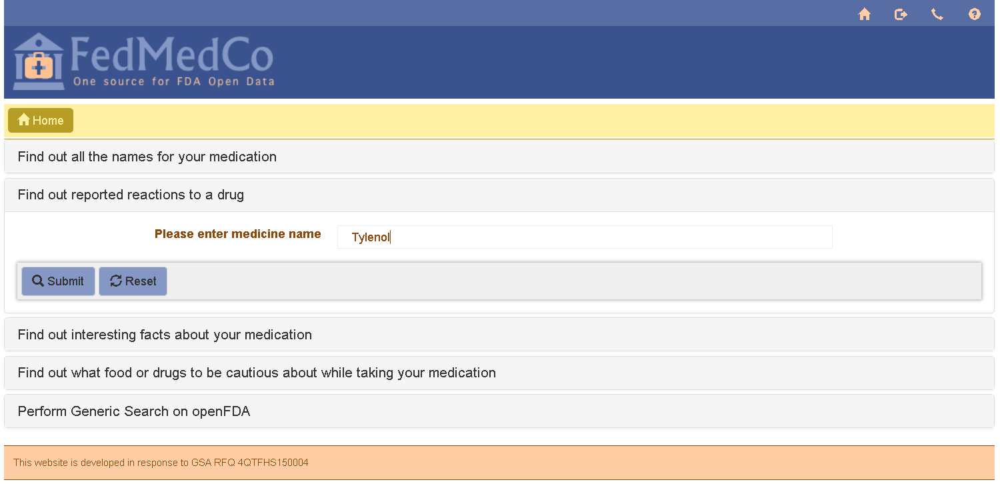
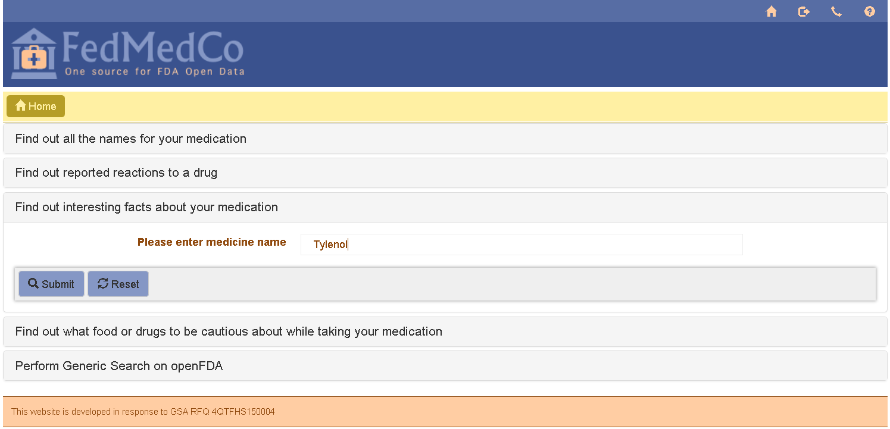
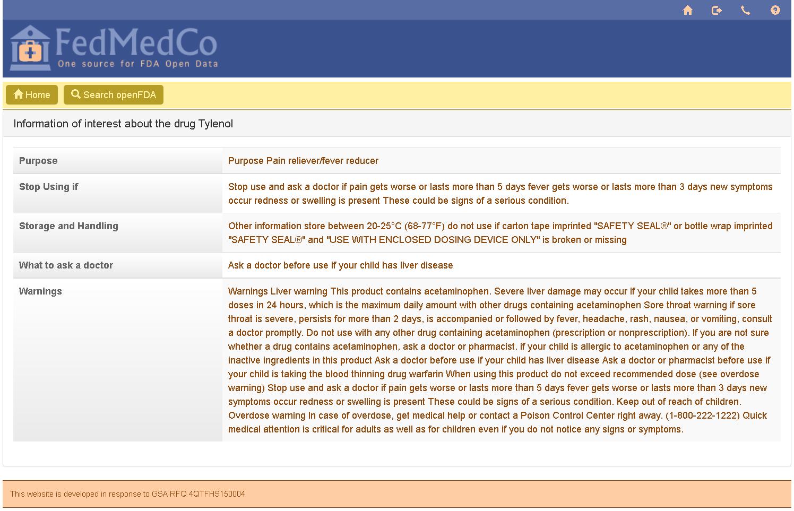
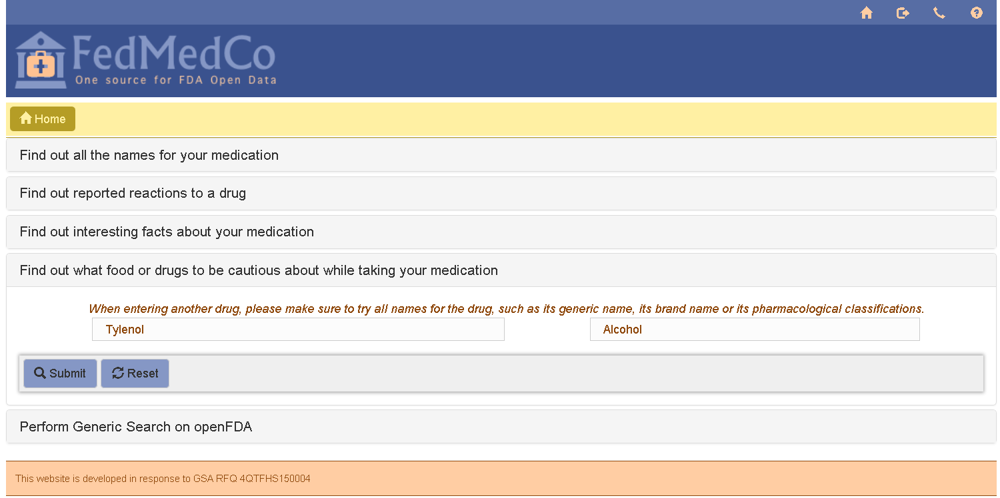
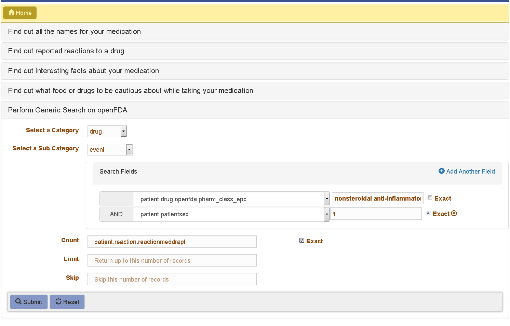

# User Guide

There are six query types that can be run, selected by clicking on the desired query type. Below is a description of each with screen shots. 

## Find out patient deaths, by country, between two reporting years, related to adverse reaction from a drug.

Input: Starting year and ending year. Select the starting year and the ending year from the selection list

Output: A color coded world map that shows reported deaths by a country when the mouse is hovered over the country.

The starting/ending years may be changed on the map itself to see the data reflected in real time.

## Find out all names for your medication.

Input: A medicine name.

Output: other names for that medication. 

##Find out reported reactions to a drug.

Input: A medicine name.

Output: The top three reactions to the drug, as well as all reactions broken down by severity. 

Click on each severity to expand that section. 

##Find out interesting facts about your medication. 

Input: A medicine name.

Output: Interesting facts about the medication.

##Find out what food or drugs to be cautious about while taking your medication

Input: A medicine name, and another medicine name or food.   

Output: Possible interactions (if any) between the given inputs.

##Perform generic search on openFDA

Input: Select the Category, Subcategory, and fields from the drop downs. Enter the values you wish to search for in the query. A compound query can be created by clicking the "Add Another Field" button to the right. 

Output: The data returned from the query. 

